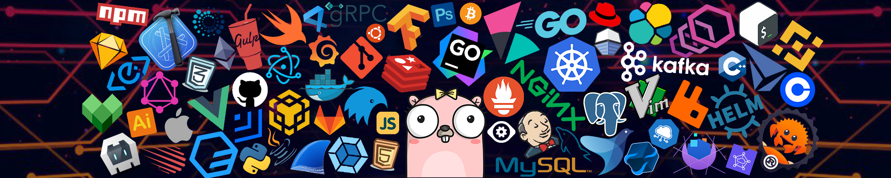

<!-- HEADER START -->

  <picture>
    <!-- Light Mode (Black Text) -->
    <source media="(prefers-color-scheme: light)" srcset="https://readme-typing-svg.herokuapp.com/?font=Righteous&size=35&center=true&vCenter=true&width=500&height=50&duration=4000&color=000000&lines=Hello+World!+👋;+I'm+Tausif+Islam+Sheik!" />
    <!-- Dark Mode (White Text) -->
    <source media="(prefers-color-scheme: dark)" srcset="https://readme-typing-svg.herokuapp.com/?font=Righteous&size=35&center=true&vCenter=true&width=500&height=50&duration=4000&color=4FC3F7&lines=Hello+World!+👋;+I'm+Tausif+Islam+Sheik!" />
    <!-- Default Image (Fallback) -->
    
  </picture>

  

<!-- 

  <h3>Full-Stack Developer </h3>
  
 Next.js • TypeScript • Go • Node.js • PostgreSQL 

 -->

<!-- 

  

 -->

<!-- HEADER END -->

---

## 👨‍💻 About Me

I’m a Full-Stack Developer based in Dhaka, Bangladesh, passionate about building scalable, efficient, and user-focused web applications. I enjoy working across the entire development lifecycle—from designing intuitive frontends to developing robust backend systems and APIs.

I primarily work with modern technologies including **Next.js, TypeScript, Go, Node.js, Express.js, and PostgreSQL**, enabling me to build fast, reliable, and production-ready applications.

With a strong focus on clean code, performance optimization, and best practices, I aim to deliver high-quality solutions that solve real-world problems. I’m continuously learning, exploring new tools, and collaborating with others to create impactful digital experiences.

---

## 🛠️ `Tech Stack`

**[ FRONTEND ]**

**[ BACKEND & DATABASE ]**

**[ TOOLS & DEVOPS ]**

---

###

## 🔥 `My Stats`

###

  

###

---

<picture>
  <source media="(prefers-color-scheme: dark)" srcset="https://raw.githubusercontent.com/tausif-islam-sheik/pacman-contribution/refs/heads/output/snake-dark.svg">
  <source media="(prefers-color-scheme: light)" srcset="https://raw.githubusercontent.com/tausif-islam-sheik/pacman-contribution/output/snake.svg">
  
</picture>

###

